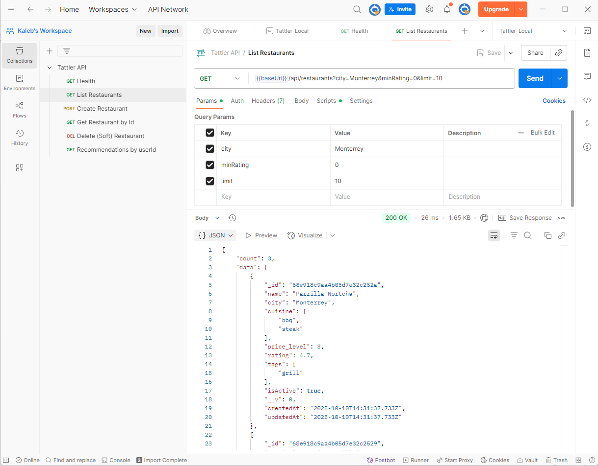
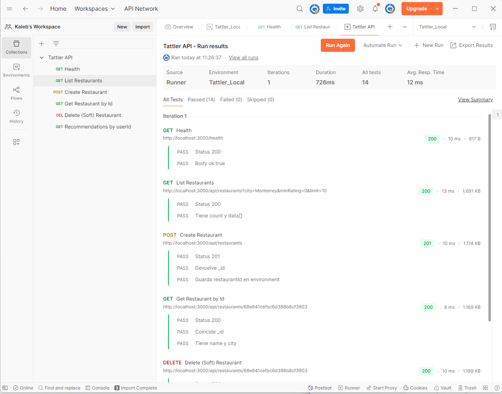

# Challenge 4: MongoDB Database Setup – Restaurant Directory Platform 

---

## **Helping Tattler**
A mexican company that offers a nationwide restaurant directory to solve the problem of decreasing traffic on its platform.

---

This README documents the **database layer** for the project where a traditional restaurant directory is transformed into a **personalized, dynamic experience**. The data is stored in a **non‑relational MongoDB** database (BSON/JSON documents) developong a RESTful API with Express.js framework. 

**Project Deliverables**  
**Sprint 1**: Set up and develop of database in MongoDB, **upload a database backup file**, including **created collections** and **import scripts from CSV files**.  
**Sprint 2**: Develop a RESTful API using Express.js and connect it to MongoDB; test with Postman/Insomnia.  
**Sprint 3**: Extend the API with **search and filtering** features; demonstrate with Postman/Insomnia tests.  

**Tattler** is a restaurant directory platform inspired by a young tour guide who personalizes tourist experiences using relevant local data.  


<details> 
<summary>Sprint 1</summary>


---
# scholar-db-mongo

Database setup for the **Google Scholar** project (In Challenge 3) as an example. Once having info about users or restaurants, DB will be managed with given data.  
This repo contains a MongoDB database example, CSV import scripts, a generated backup placeholder, and screenshots.

## 1) Description of the project
This Sprint initializes a MongoDB database named `scholar_db` with two collections:
- `authors`
- `articles`

It includes:
- Data samples in CSV (`/data`)
- Import scripts in PowerShell (`/scripts`)
- A backup **placeholder** created now (`/backup/dump-YYYYMMDD-HHmm/`) with instructions to generate a real dump

## Repository structure

```
scholar-db-mongo/
├─ data/
│  ├─ authors.csv
│  └─ articles.csv
├─ scripts/
│  └─ import.ps1
├─ backup/
│  └─ dump-YYYYMMDD-HHmm/   
├─ screenshots/
│  ├─ 01-database-and-collections.png       
│  ├─ 02-authors-docs.png                   
│  └─ 03-articles-indexes.png              
├─ .gitignore
└─ README.md
```

---

## Installation & Usage

### 1) Prerequisites
- **MongoDB Community Server** (runs as a Windows service)
- **MongoDB Shell (`mongosh`)**
- **MongoDB Database Tools** (*provides `mongoimport`, `mongodump`, `mongorestore`*)
- **MongoDB Compass** (GUI)
- **Git** (to clone and commit to GitHub/GitLab)
- (Optional for later sprints) **Node.js 20+** and **VS Code**

> All have free Community/Free plans suitable for this project.

### 2) Verify tools (Windows PowerShell)
```powershell
sc query MongoDB           # Should show RUNNING
mongosh --version          # Shows the shell version
mongoimport --version      # From Database Tools
mongodump --version        # From Database Tools
```

If `mongoimport`/`mongodump` are not recognized, install **MongoDB Database Tools** or add their `bin` folder to your `PATH`
(e.g., `C:\Program Files\MongoDB\Tools\100\bin`).


### 3) Creation of database and collections

**Option A — MongoDB Compass (GUI):**
1. Connect to `mongodb://localhost:27017`
2. Click connection (e.g., `localhost:27017`) → **Databases** → **Create database**
3. **Database name**: `restaurant_db`  
   **Collection name**: `restaurants` → **Create Database**
4. Create additional collection(s): `users`, `reviews` 

**Option B — Mongosh (CLI):**
```javascript
mongosh
use("restaurant_db")
db.createCollection("restaurants")
db.createCollection("users")
```


### 4) Definition of a minimal data model

### Steps
1. Open **Compass** and connect to `mongodb://localhost:27017`.
2. Create database `scholar_db` with collections `authors` and `articles` (or just run the import script which creates them automatically).
3. From the project root, run:
   ```powershell
   .\scripts\import.ps1
   ```
4. Verify documents in Compass.
5. Create indexes in Compass:
   - In `articles`: unique index on `articleId` (Ascending 1)
   - In `articles`: text index on `title`
   - (Optional) In `authors`: unique index on `authorId`


### Backup / Restore
A **placeholder** backup folder has been created now at `/backup/dump-20251008-0552/`.  
To generate a real dump on machine, run:
```powershell
$stamp = Get-Date -Format "yyyyMMdd-HHmm"
mongodump --db scholar_db --out ".\backup\dump-$stamp"
```
To restore (if needed):
```powershell
mongorestore --db scholar_db ".\backup\dump-YYYYMMDD-HHmm\scholar_db"
```


---

## Versioning & Commit Style (suggested)

Use **Major.Minor.Patch** and mention it in commit messages, e.g.:
- `feat: initial CSVs and import script (Version 1.0.0)`
- `feat: add text index on restaurants.name (Version 1.1.0)`
- `fix: CSV typo (Version 1.1.1)`

---

## Troubleshooting

- **“mongoimport is not recognized”** → Install **MongoDB Database Tools** or add its `bin` to PATH.  
- **Case conflicts (`restaurant_db` vs `Restaurant_DB`)** → Keep a single, consistent name everywhere.  
- **No data appears in Compass** → Click **Refresh** (circular arrow) after import; ensure you’re viewing `restaurant_db`.  
- **Dump is too large for the repo** → Compress the folder before commit, or clean test data and re‑dump.

---

</details>

<details>
<summary>Sprint 2</summary>

# 🥗 Tattler API — Sprint 2 / Challenge 4
> Transforming a restaurant directory into a dynamic, personalized experience  
> _Built with Express.js + MongoDB_


---

## 🌐 Project Overview

During **Sprint 2**, the goal was to implement a fully functional **RESTful API** with Express and MongoDB to handle restaurant data and generate personalized recommendations.

### Sprint Objectives
1. Develop the RESTful API using **Express.js** and **MongoDB**.  
2. Implement **peer reviews** to detect integration or logic errors early.  
3. Create **Postman tests** that validate API functionality.  
4. Ensure the codebase is **well-structured, organized, and documented**.

---

## ⚙️ Tech Stack

| Layer | Technology |
|-------|-------------|
| Backend | Node.js 18 + Express.js (ESM Modules) |
| Database | MongoDB + Mongoose ODM |
| Environment | dotenv (.env files) |
| Tools | Nodemon, ESLint, Prettier |
| Testing | Postman GUI + Newman CLI |
| Architecture | MVC (Model – View – Controller) |

---

## 🧩 Repository Structure
```
tattler-api/
├─ .env.example
├─ .gitignore
├─ package.json
├─ README.md
├─ openapi.yaml
│
├─ postman/
│  ├─ Tattler_API.postman_collection.json
│  └─ Tattler_Local.postman_environment.json
│
├─ src/
│  ├─ index.js
│  ├─ app.js
│  ├─ config/db.js
│  ├─ controllers/
│  │  ├─ restaurant.controller.js
│  │  └─ recommendation.controller.js
│  ├─ middlewares/error.js
│  ├─ models/
│  │  ├─ restaurant.model.js
│  │  └─ user.model.js
│  ├─ routes/
│  │  ├─ index.js
│  │  ├─ restaurant.routes.js
│  │  └─ recommendation.routes.js
│  ├─ utils/
│  │  ├─ ApiFeatures.js
│  │  └─ httpResponses.js
│  └─ seeds/seed.js
└─ tests/e2e-notes.md
```

---

## 🚀 Installation & Setup

### 1️⃣ Install Dependencies
```bash
npm install
```

### 2️⃣ Configure Environment
```bash
cp .env.example .env
```
Update the values if needed:
```
PORT=3000
MONGODB_URI=mongodb://127.0.0.1:27017/tattler
NODE_ENV=development
```

### 3️⃣ Seed Database
```bash
npm run seed
```
Expected output:
```
MongoDB connected
Seed done. userId= 68e90ae3055527d918bace80
```
Save this **userId** for Postman tests.

### 4️⃣ Run Server
```bash
npm run dev
```
Visit: [http://localhost:3000/health](http://localhost:3000/health)

---

## 📡 API Endpoints

| Method | Endpoint | Description |
|:-------|:----------|:-------------|
| `GET` | `/health` | Health check |
| `GET` | `/api/restaurants` | List restaurants (filters, sort, pagination) |
| `GET` | `/api/restaurants/:id` | Get restaurant by ID |
| `POST` | `/api/restaurants` | Create restaurant |
| `PATCH` | `/api/restaurants/:id` | Update restaurant |
| `DELETE` | `/api/restaurants/:id` | Soft-delete restaurant |
| `GET` | `/api/recommendations?userId=<id>` | Get personalized recommendations |

### Query Parameters
`city`, `cuisine`, `minRating`, `maxPrice`, `sort`, `page`, `limit`, `search`

---

## 💻 Example Requests (cURL)

**Health**
```bash
curl http://localhost:3000/health
```

**List Restaurants**
```bash
curl "http://localhost:3000/api/restaurants?city=Monterrey&minRating=4"
```

**Create Restaurant**
```bash
curl -X POST "http://localhost:3000/api/restaurants"   -H "Content-Type: application/json"   -d "{"name":"Nuevo Spot","city":"Monterrey","cuisine":["mexican"],"price_level":2,"rating":4.3}"
```

**Recommendations**
```bash
curl "http://localhost:3000/api/recommendations?userId=68e90ae3055527d918bace80"
```

---

## 🧪 Postman & Newman Tests

### Folder Structure
```
postman/
├─ Tattler_API.postman_collection.json
└─ Tattler_Local.postman_environment.json
```

### How to Import in Postman
1. Open **Postman → Import → Upload Files**.  
2. Select both JSON files above.  
3. Choose environment **Tattler_Local**.  
4. Update the variable `userId` with your seeded ID.

### Run Tests in Postman
- Click **▶ Run collection** inside Postman.
- All 6 requests should return status 200/201.

### Run Tests via Newman
```bash
npm run test:api
```

Expected output:
```
→ Health ✓
→ List Restaurants ✓
→ Create Restaurant ✓
→ Get Restaurant by Id ✓
→ Delete (Soft) Restaurant ✓
→ Recommendations by userId ✓
✔ 6 requests, 0 failures
```




---

## 🤝 Peer Review Process

- Feature branches:  
  `feature/restaurants-crud`, `feature/recommendations`, etc.  
- **Three partial reviews**
  1. API skeleton + database connection  
  2. CRUD and filtering  
  3. Recommendations + Postman tests  
- Each PR includes:
  - Checklist ✅  
  - Screenshots of Postman tests  
  - Notes in `docs/peer-reviews/PR-xxxx-NOTES.md`

---

## 🧰 NPM Scripts

| Command | Description |
|:--------|:-------------|
| `npm run dev` | Start API with nodemon |
| `npm start` | Run API with Node |
| `npm run seed` | Seed MongoDB with sample data |
| `npm run lint` | Lint code style |
| `npm run test:api` | Run Postman collection with Newman |

---

## 🗂️ Database Samples

**Restaurant**
```json
{
  "name": "Taquería La Silla",
  "city": "Monterrey",
  "cuisine": ["mexican"],
  "price_level": 1,
  "rating": 4.5,
  "tags": ["tacos", "casual"],
  "isActive": true
}
```

**User**
```json
{
  "email": "demo@tattler.com",
  "name": "Demo",
  "preferences": {
    "cuisines": ["mexican", "bbq"],
    "priceRange": { "max": 3 },
    "cities": ["Monterrey"]
  }
}
```

---

## 📘 Documentation
- `openapi.yaml` → Minimal OpenAPI specification  
- `README.md` → Setup, usage, and testing guide  
- `docs/peer-reviews/` → Notes and fixes from reviews  

---

## 🚧 Future Improvements
- Add Joi validation for request bodies  
- Implement JWT authentication  
- Add Docker support for deployment  
- Extend recommendation logic (AI/data-driven filtering)

---


</details>


<details>
<summary>Sprint 3</summary>

----

Throughout **Sprint 3**, the project was expanded with **new search, filtering, sorting, and pagination features** that allow users to retrieve restaurant data dynamically and efficiently.

These improvements provide a more flexible experience for users to:
- 🔎 Search restaurants by name, cuisine, or tags.
- 🧩 Filter results by city, cuisine, price range, rating, or open status.
- ↕️ Sort results dynamically by rating, price, name, or creation date.
- 📄 Paginate results through `page` and `limit` query parameters.

---

## 🎯 Project Purpose
The main objective of this sprint is to enhance the usability and functionality of the Tattler API by:
- Implementing **intelligent search mechanisms** through MongoDB text indexes.
- Allowing **dynamic filtering** and **custom sorting** in API queries.
- Improving **response efficiency** through pagination and optimized database indexes.
- Ensuring reliability through **Postman and Newman tests** demonstrating each feature’s performance.

---

## ⚙️ Installation and Usage Instructions

### 1️⃣ Clone the Repository
```bash
git clone https://github.com/<your-username>/tattler-api.git
cd tattler-api
```

### 2️⃣ Install Dependencies
```bash
npm install
```

### 3️⃣ Create the `.env` File
Inside the project root, create a `.env` file with the following content:

```env
PORT=3000
NODE_ENV=development
MONGODB_URI=mongodb://127.0.0.1:27017/tattler
MONGO_URI=mongodb://127.0.0.1:27017
MONGO_DBNAME=tattler
```

> ⚠️ Make sure MongoDB service is running before starting the server.

### 4️⃣ Create Database Indexes
Run the script to ensure all indexes required for filtering and searching are properly created:

```bash
npm run make:indexes
```

### 5️⃣ Start the Development Server
```bash
npm run dev
```

Server running at:  
➡️ `http://localhost:3000`

---

## 🧩 Repository Structure

```
tattler-api/
│
├── src/
│   ├── config/
│   │   └── db.js                  # Database connection setup
│   ├── controllers/
│   │   └── restaurant.controller.js   # Controller with search, filter & sort logic
│   ├── models/
│   │   └── restaurant.model.js    # Mongoose schema and indexes definition
│   ├── routes/
│   │   └── restaurant.routes.js   # Express routes for restaurant endpoints
│   ├── scripts/
│   │   └── create-indexes.js      # Script to create or sync MongoDB indexes
│   └── index.js                   # Main application entry point
│
├── postman/
│   ├── Tattler_API.postman_collection.json
│   ├── Tattler_Search.postman_collection.json
│   └── Tattler_Local.postman_environment.json
│
├── .env
├── package.json
└── README.md
```

---

## 🔗 API Endpoints Summary

### `GET /api/restaurants`
Fetches a list of restaurants applying **search**, **filter**, **sort**, and **pagination** options.

#### Query Parameters
| Parameter | Type | Description |
|------------|------|-------------|
| `q` | String | Text search on `name`, `tags`, and `cuisine`. |
| `city` | String | Filter by city. |
| `cuisine` | String | Filter by cuisine (comma-separated list). |
| `price_min`, `price_max` | Number | Filter by price range. |
| `rating_gte` | Number | Minimum rating. |
| `open_now` | Boolean | Filter by open restaurants only. |
| `sort` | String | Sort by field (`rating`, `price`, `name`, `createdAt`). |
| `order` | String | Sorting order (`asc` or `desc`). |
| `page` | Number | Page number for pagination. |
| `limit` | Number | Items per page. |

#### Example Response
```json
{
  "page": 1,
  "limit": 5,
  "total": 32,
  "totalPages": 7,
  "items": [
    {
      "_id": "6521d...",
      "name": "La Casa del Taco",
      "city": "Monterrey",
      "cuisine": ["Mexican"],
      "price": 120,
      "rating": 4.7,
      "openNow": true
    }
  ]
}
```

---

## 🧪 Testing

### 🔹 Postman Testing (Manual)
Import the following into **Postman**:
- `postman/Tattler_Search.postman_collection.json`
- `postman/Tattler_Local.postman_environment.json`

Set environment to **Tattler_Local** and run the requests to validate:
- Text search (`q` parameter)
- Filters (`city`, `cuisine`, `rating_gte`, `price_min/max`)
- Sorting (`sort` + `order`)
- Pagination (`page`, `limit`)

#### 💡 Recommended Screenshots for README


📸 *SS that will be added here*:


1. **Search test** — Demonstrating `q` and `city` filters.  
2. **Sorting test** — Showing results ordered by `rating desc`.  
3. **Pagination test** — Showing multiple pages of results.  
4. **Combined filters** — Example of query with `cuisine`, `rating_gte`, and `open_now`.  


---

### 🔹 Newman CLI Testing (Automated)
Run the automated test collection in the terminal:

```bash
npm run test:search
```

This uses **Newman** to validate all endpoints automatically and stops execution if any test fails.

---

## 🧱 Database Indexes
Indexes are managed by `create-indexes.js` and automatically synchronized from your Mongoose model:

| Index Type | Fields | Description |
|-------------|---------|-------------|
| Text | `name`, `tags`, `cuisine` | Enables text search (`q` parameter). |
| Ascending/Descending | `price`, `rating`, `createdAt` | Optimizes sorting performance. |
| Boolean | `isActive`, `openNow` | Supports filters for availability and active status. |

---

## 📚 Key Learnings and Improvements
- Integration of **dynamic query handling** for search and filtering.  
- Creation and synchronization of **MongoDB indexes** for performance.  
- Practical understanding of **RESTful architecture and API parameterization**.  
- Automated testing setup with **Postman and Newman**.  
- Enhanced API maintainability through modular structure.

---


</details>


## 🧠 Skills Required

### 💼 Hard Skills — Knowledge of:
- Database management systems  
- Databases & data modeling  
- Understanding of relational, non-relational, and distributed databases  
- MongoDB  

### ⚙️ Technical:
- Managing non-relational databases  
- JSON format handling  
- Proficiency in MongoDB  
- Proficiency in Studio 3T (optional alternative to Compass)  

### 🤝 Soft Skills:
- Results-oriented mindset  
- Quality-focused development  
- Analytical thinking  
- Team collaboration  

---

## ♻️ Sustainability

This project was designed with long-term **technical** and **environmental sustainability** in mind, ensuring efficient resource usage, modular growth, and minimal waste.

### 🌿 1. Efficient Resource Use  
By using a **non-relational MongoDB database** and **RESTful API** architecture, the system minimizes redundant data and optimizes query performance.  
Each request retrieves only what is necessary, reducing computational load and energy consumption. The JSON-based format ensures lightweight data transfer and efficient storage.

### 🧩 2. Reusability and Modularity  
Developed with **Express.js** under a **modular structure**, each component (routes, controllers, and models) can be maintained or expanded independently.  
This modularity reduces the need for full system redeployment, making the project easier to update and adapt over time.

### ⚙️ 3. Lightweight Infrastructure  
The system runs smoothly on minimal hardware and can be deployed to **low-cost cloud environments**.  
Automated scripts handle data imports, backups, and database management efficiently, minimizing maintenance time and resource consumption.

### 🌍 4. Open Knowledge and Educational Impact  
All documentation, scripts, and database structures are shared openly, encouraging **reuse, learning, and collaboration**.  
This openness promotes sustainable knowledge growth and supports academic and open-source communities.

---

## 🚀 Scalability and Long-Term Viability

The project architecture was built to support **future growth**, ensuring that it can evolve, scale, and remain functional over the long term.

### 📈 1. Horizontal and Vertical Scalability  
MongoDB supports **horizontal scaling**, allowing the database to grow seamlessly as data or users increase.  
The Express.js API can easily integrate new endpoints or services without performance loss, supporting continuous platform expansion.

### 🧠 2. Future-Proof Architecture  
The combination of **Node.js + Express + MongoDB** guarantees compatibility with emerging web technologies.  
MongoDB’s **flexible schema** allows adding new attributes or collections without breaking existing functionality.

### 🧰 3. Maintainability and Low Technical Debt  
Using the **MVC pattern**, automated import scripts, and clear documentation ensures the codebase is easy to maintain.  
Future developers can extend or refactor components with minimal effort, prolonging the project’s useful life.

### 💰 4. Economic and Operational Viability  
This project uses only **open-source tools**, avoiding license fees and vendor lock-in.  
Its lightweight server requirements make it **cost-effective**, ideal for educational use, small organizations, or startups.

### 🌱 5. Sustainable Growth Strategy  
The database and REST API are optimized for scalable performance.  
Even as the data volume or user traffic increases, the architecture ensures **stable performance, low latency, and efficient cost scaling**.

---

## 🧭 Scalability Diagram

Below is a simplified view of how the project scales across its main layers:

```plaintext
                ┌───────────────────────────────┐
                │         CLIENT SIDE           │
                │  (User Interface / Frontend)  │
                └──────────────┬────────────────┘
                               │
                               ▼
                ┌───────────────────────────────┐
                │        EXPRESS SERVER         │
                │   RESTful API / Controllers   │
                └──────────────┬────────────────┘
                               │
                               ▼
                ┌───────────────────────────────┐
                │           MONGODB             │
                │  Non-relational JSON storage  │
                └──────────────┬────────────────┘
                               │
                               ▼
                ┌───────────────────────────────┐
                │    CLOUD INFRASTRUCTURE       │
                │ (Horizontal Scaling Enabled)  │
                └───────────────────────────────┘


## 🧰 Licenses / Tools Used

### 🏁 Sprints 1, 2, and 3
- **MongoDB** — Creation of databases, collections, and indexes *(Community edition)*  
- **GitHub or GitLab** — Code storage & version control  
- **Visual Studio Code** — Integrated Development Environment  

### ⚙️ Sprints 2 and 3
- **Express.js** — RESTful API development  
- **Postman or Insomnia** — API testing  

💡 *All listed tools are free.*  
Visual Studio Code, Express.js, and GitHub are open-source.  
Postman, Insomnia, and MongoDB provide **permanent free plans** with the necessary professional features. *(Select MongoDB Community Edition.)*

---

## 💲 Cost & Time Estimation

| **Item** | **Description** | **Estimate** |
|-----------|-----------------|---------------|
| **Hourly rate** | $125 USD/hour | — |
| **Total effort** | 12 hours *(scoping 2h · implementation 7h · verification & README 3h)* | — |
| **Estimated total (T&M)** | $1,500 USD | *(Range: $1,125 – $1,750 for 9–14h)* |
| **Payment milestones** | 50% on kickoff · 50% on delivery | — |
| **Validity** | 14 days | — |
| **Changes to scope** | Billed at $125/hour | — |

### 💵 Cost Diagram
A visual breakdown of the project budget and time distribution:

```plaintext
        ┌──────────────────────────────────────┐
        │          COST & TIME OVERVIEW        │
        └──────────────────────────────────────┘
                   │
                   ▼
     ┌──────────────────────────┐
     │   Scoping Phase (2h)     │  $250
     │  ──────────────────────  │
     │  Requirements analysis   │
     │  Architecture planning   │
     └──────────────────────────┘
                   │
                   ▼
     ┌──────────────────────────┐
     │ Implementation (7h)      │  $875
     │  ──────────────────────  │
     │  Database setup (Mongo)  │
     │  API development (Express)│
     │  Testing (Postman)       │
     └──────────────────────────┘
                   │
                   ▼
     ┌──────────────────────────┐
     │ Verification & README (3h)│  $375
     │  ──────────────────────  │
     │  Documentation & QA      │
     │  Code delivery & cleanup │
     └──────────────────────────┘
                   │
                   ▼
     ┌──────────────────────────┐
     │  Total: 12h = $1,500 USD │
     └──────────────────────────┘
```
---

## 👤 Author
**Iván Kaleb Ramírez Torres**  
_Bécalos TechnoReady — Challenge 4 (October, 2025)_  
Database: MongoDB | Backend: Express.js | Testing: Postman + Newman  
[GitHub Repository](https://github.com/rtkaleb/Challenge4)
